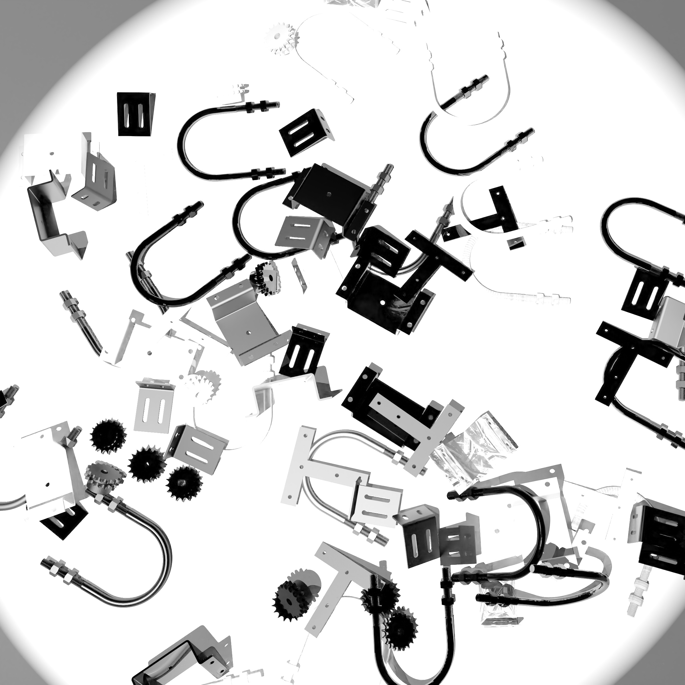
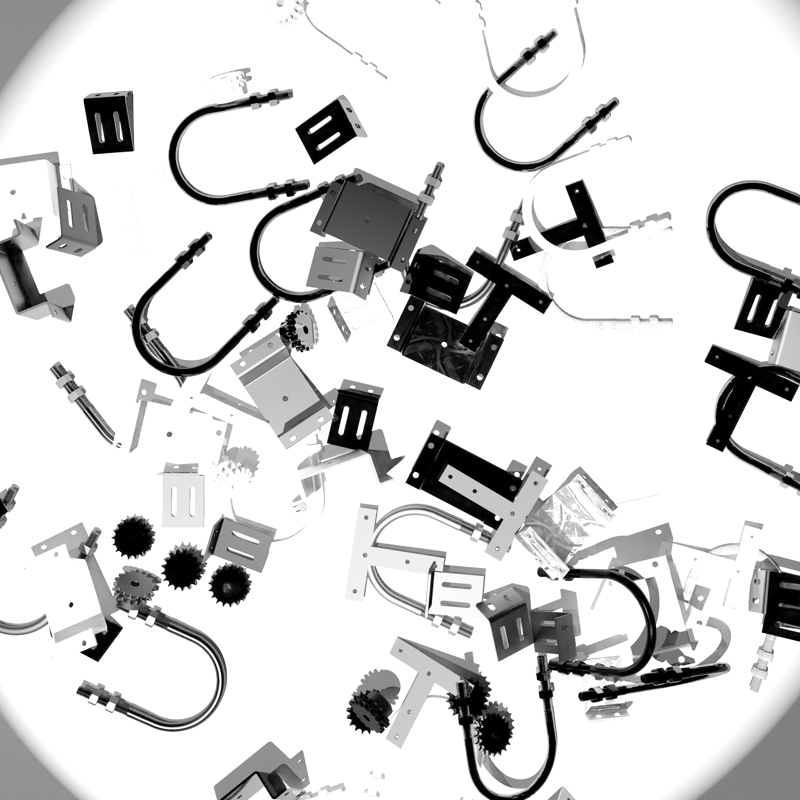
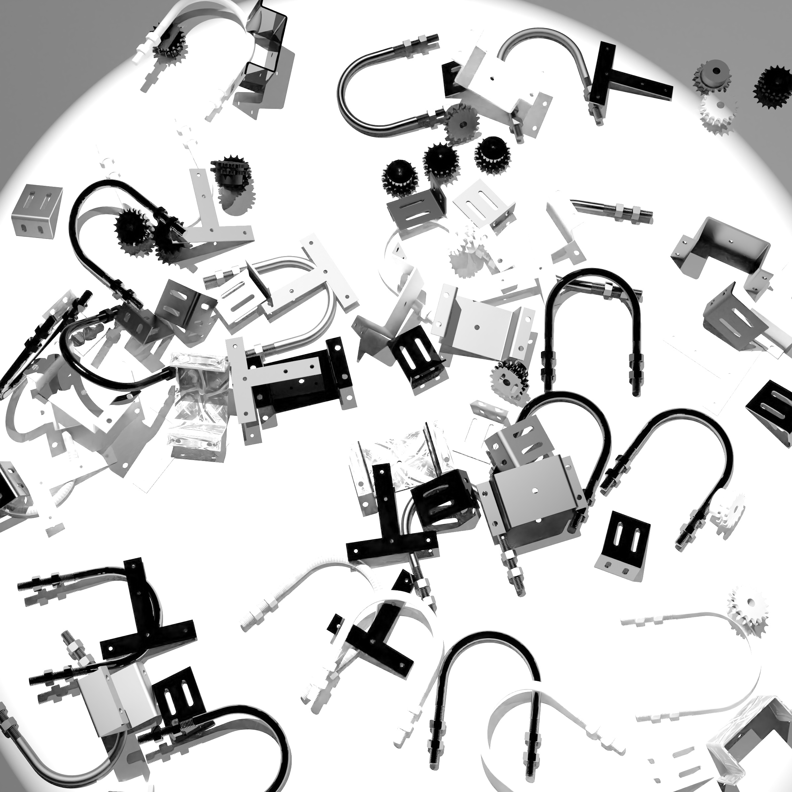
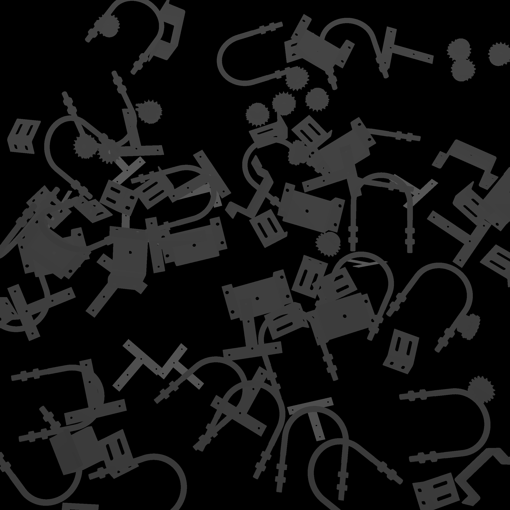
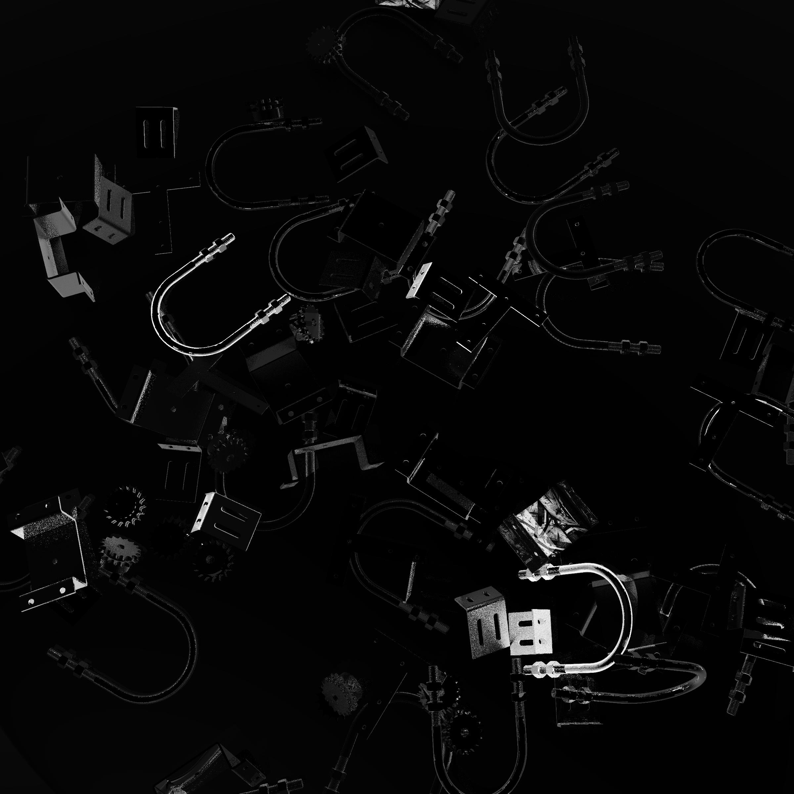
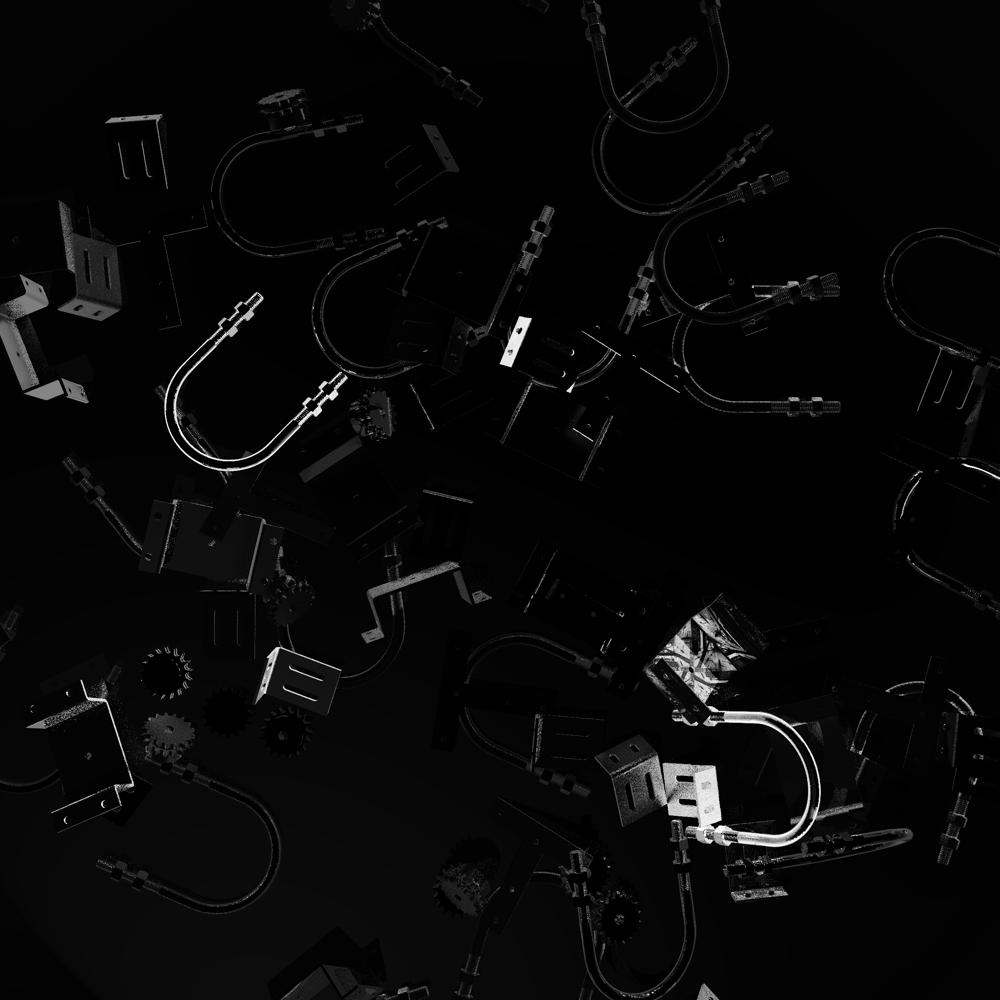
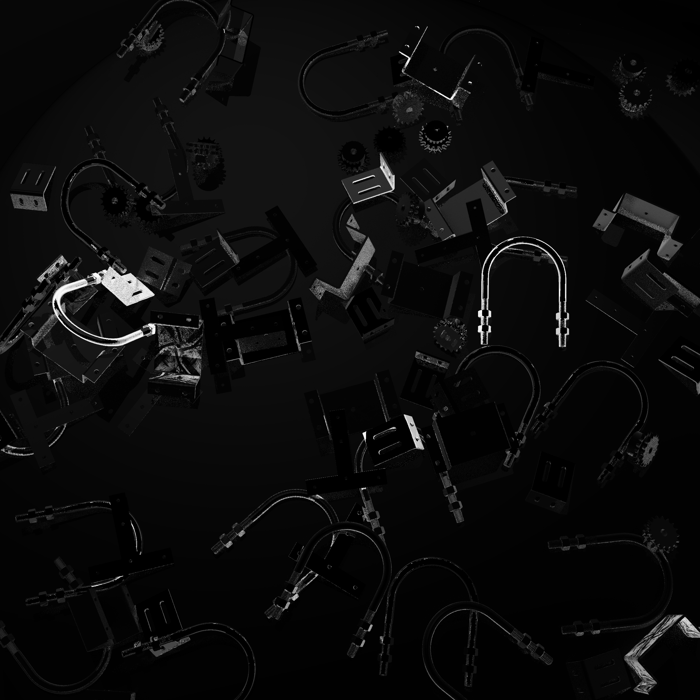
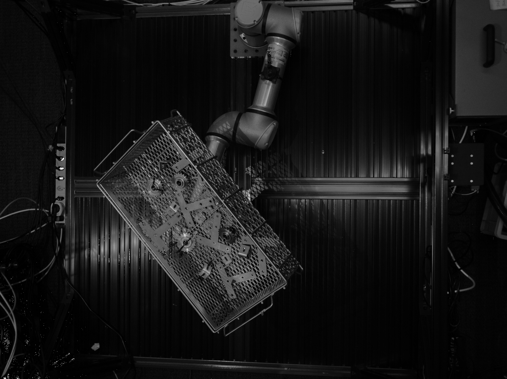
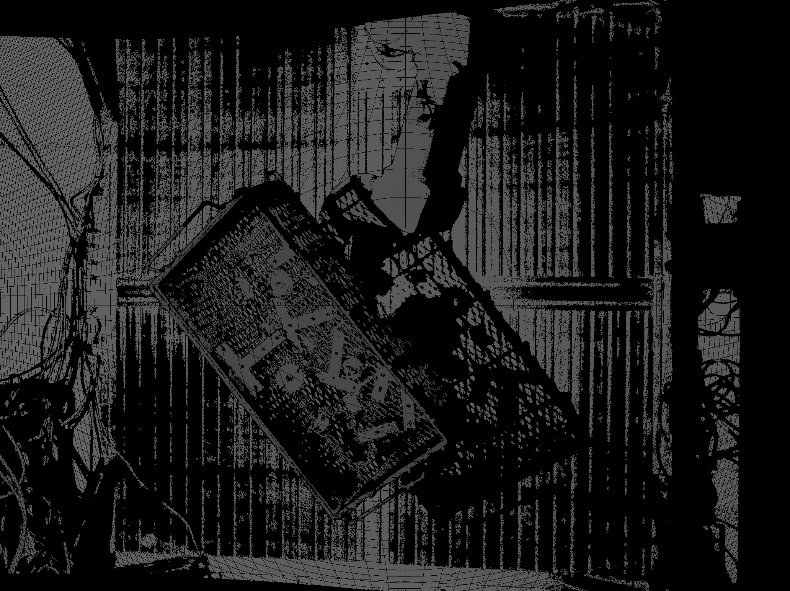

## bpc_teamname

**TODO:** find a team name

This is teamname's Bin Picking Challenge repository.

Our solution offers a solution to the problem of 6D pose estimation of seen objects.

### Datasets

The bpc challenge will be ranking the teams based on the mean average Precision (mAP) over a set of MSSD (Maximum Symetry-Aware Surface Distance) thresholds on the IPD dataset.

The dataset is available in the [BOP format](https://github.com/thodan/bop_toolkit/blob/master/docs/bop_datasets_format.md) on [HuggingFace](https://huggingface.co/datasets/bop-benchmark/ipd).

Method obtained can also be tested on the other datasets availble in the BOP format, such as the [T-LESS](https://huggingface.co/datasets/bop-benchmark/tless) dataset.

#### IPD

The IPD dataset is a dataset made by [intrinsics](https://www.intrinsic.ai/).

The training images are available in the `train_pbr` split, and the validation images are available in the `val` split. The former is composed of symthetic images and the latter of real images. Both are annotated with the ground truth 6D poses of the objects in the scene in the `scene_gt.json` file.

The test images are available in the `test` split, and are not annotated with the ground truth 6D poses of the objects in the scene.

For the training split :

- Scenes 000000–000004 contain objects 0, 8, 18, 19, 20.
- Scenes 000005–000009 contain objects 1, 4, 10, 11, 14.

Every scene is offered from the view of multiple multi-model cameras, including rgb, depth, and polarized images. Masks are also available for the pbr training images, with both the visible part, and the entire object (including the occluded parts).

Here are some examples of the images in the dataset : 

- `train_pbr` split :

 modality   | Cam 1   |   Cam 2 |  Cam3  
---:|:-------------------------:|:-------------------------:|:---------:
rgb |   |   |   
depth |   |   |   
aolp |   |   |   
dolp |   |   |   

- `val` and `test` splits :

 modality   | Cam 1   |   Cam 2 |  Cam3  | photoeno
---:|:-------------------------:|:-------------------------:|:---------:|-------:
rgb |   |   |    | 
depth |   |   |    | 
aolp |   |   |   
dolp |   |   |   

## Team Members

- @Tekexa
- @VincidaB

## Credits