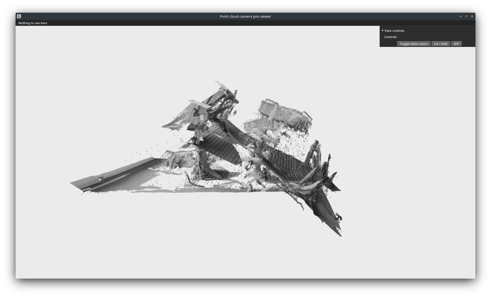
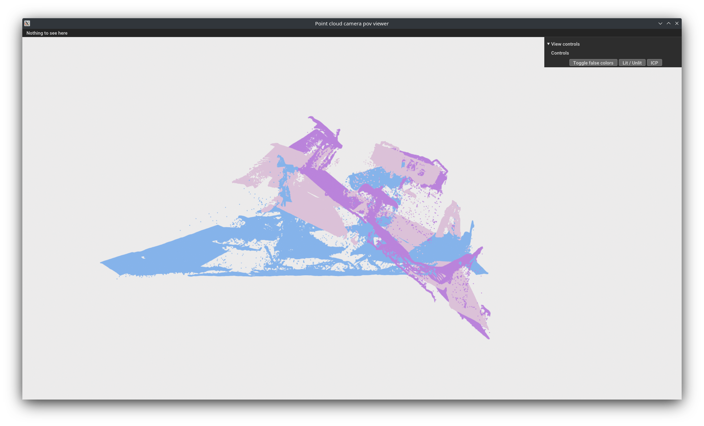

## Utils

Here are some utility scripts that were used during the development of the project.

### visualiser.py

Used to display point clouds formed by the depth images of multiple cameras. The point clouds can be false colored based on the camera they belong to, in order to distinguish between them. 

  
  

ICP can be used to align the point clouds, even though we will use the camera extrinsics to align them in the final implementation.